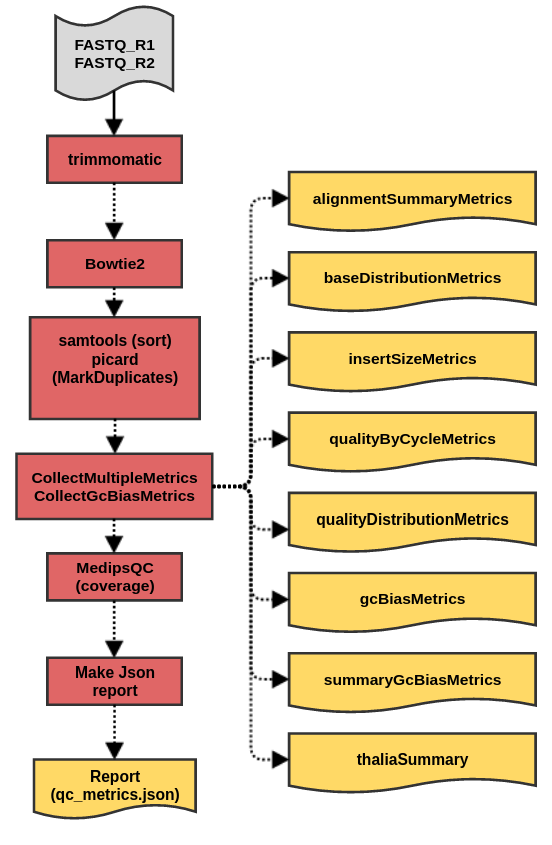

# cfMedipsQc

cfMedipsQC workflow produces a set of metrics files for sequencing data generated in methylation profiling of circulating Free DNA




## Dependencies

* [samtools 1.9](https://github.com/samtools/samtools)
* [bowtie2 2.1.0](https://github.com/BenLangmead/bowtie)
* [picard 2.21.2](https://github.com/broadinstitute/picard/)
* [rstats 3.5](https://www.r-project.org/)
* [python 3.6](https://www.python.org/)
* [cfmedips 1.5](https://github.com/oicr-gsi/medips-tools.git)
* [trimmomatic 0.39](https://github.com/timflutre/trimmomatic)
* [bedops 2.4.37](https://github.com/bedops/bedops)
* [bc 2.1.3](https://github.com/gavinhoward/bc/)


## Usage

### Cromwell
```
java -jar cromwell.jar run cfMedipsQc.wdl --inputs inputs.json
```

### Inputs

#### Required workflow parameters:
Parameter|Value|Description
---|---|---
`fastq1`|File|Read 1 input fastq file
`fastq2`|File|Read 2 input fastq file
`referenceGenome`|String|reference genome to use
`referenceModule`|String|module to load the reference genome
`fastqFormat`|String|Quality encoding, default is phred33, but can be set to phred64


#### Optional workflow parameters:
Parameter|Value|Default|Description
---|---|---|---
`window`|Int|300|window length, over which to assess


#### Optional task parameters:
Parameter|Value|Default|Description
---|---|---|---
`trimming.fastq1Basename`|String|basename("~{fastq1}","_R1_001.fastq.gz")|Basename for the first fastq
`trimming.fastq2Basename`|String|basename("~{fastq2}","_R2_001.fastq.gz")|Basename for the second fastq
`trimming.headCrop`|Int|5|How many bases to crop
`trimming.threads`|Int|6|Requested CPU threads
`trimming.jobMemory`|Int|16|Memory (GB) allocated for this job
`trimming.timeout`|Int|6|Number of hours before task timeout
`trimming.modules`|String|"trimmomatic/0.39"|Module needed to run trimmomatic extract
`alignment.basename`|String|basename("~{fastq1Paired}",".R1_paired.fastq.gz")|Name to make output sam file
`alignment.threads`|Int|8|Requested CPU threads
`alignment.jobMemory`|Int|16|Memory (GB) allocated for this job
`alignment.timeout`|Int|6|Number of hours before task timeout
`alignment.modules`|String|"bowtie2/2.1.0 ~{referenceModule}"|Module needed to run bowtie2 alignment
`preprocessing.basename`|String|basename("~{samFile}",".sam")|Name to make output files
`preprocessing.threads`|Int|8|Requested CPU threads
`preprocessing.jobMemory`|Int|16|Memory (GB) allocated for this job
`preprocessing.timeout`|Int|6|Number of hours before task timeout
`preprocessing.modules`|String|"samtools/1.9 picard/2.21.2"|Module needed to run preprocessing
`alignmentMetrics.basename`|String|basename("~{dedupBam}",".sorted.dedup.bam")|Name to make output files
`alignmentMetrics.threads`|Int|8|Requested CPU threads
`alignmentMetrics.jobMemory`|Int|32|Memory (GB) allocated for this job
`alignmentMetrics.timeout`|Int|6|Number of hours before task timeout
`alignmentMetrics.modules`|String|"samtools/1.9 picard/2.21.2 ~{referenceModule} bc/2.1.3 rstats/3.5"|Modules needed to run alignment metrics
`extractMedipsCounts.basename`|String|basename("~{dedupBam}",".sorted.dedup.bam")|basename for the sample
`extractMedipsCounts.convert2bed`|String|"$BEDOPS_ROOT/convert2bed"|path to conver2bed program
`extractMedipsCounts.threads`|Int|8|Requested CPU threads
`extractMedipsCounts.jobMemory`|Int|32|Memory (GB) allocated for this job
`extractMedipsCounts.timeout`|Int|6|Number of hours before task timeout
`extractMedipsCounts.modules`|String|"rstats/3.5 cfmedips/1.5 bedops/2.4.37"|Modules needed to run alignment metrics
`finalMetrics.threads`|Int|8|Requested CPU threads
`finalMetrics.jobMemory`|Int|16|Memory (GB) allocated for this job
`finalMetrics.timeout`|Int|6|Number of hours before task timeout
`finalMetrics.modules`|String|"cfmedips/1.5"|Modules needed to run alignment metrics


### Outputs

Output | Type | Description
---|---|---
`outputAlignmentSummaryMetrics`|File|Metric for alignments
`outputBaseDistributionMetrics`|File|Metrics for base distributions
`outputInsertSizeMetrics`|File?|Metrics for insert size (Optional, when enough data are available)
`outputQualityByCycleMetrics`|File|Quality by cycle metrics
`outputQualityDistributionMetrics`|File|Quality distribution metrics
`outputGcBiasMetrics`|File|gc bias metrics
`outputSummaryGcBiasMetrics`|File|Summary of gc bias metrics
`outputThaliaSummary`|File|Summary of thalia chromosomes
`outputDedupBam`|File|De-duplicated bam file
`outputqcMetrics`|File|Final output


## Commands
 This section lists commands run by cfMedipsQC workflow
 
 * Running cfMedipsQC
 
 cfMedipsQC is designed to produce several QC metrics using samtools and picard. Runs it's own alignment with bowtie2
 
 Run read trimming with trimmomatic
 
 '''
     set -euo pipefail
     trimmomatic PE  FASTQ_R1 FASTQ_R2 \
                 "-phred33 \  (can be set to phred64)
                 "FASTQ_R1_BASENAME.R1_paired.fastq.gz" "FASTQ_R1_BASENAME.R1_unpaired.fastq.gz" "FASTQ_R2_BASENAME.R2_paired.fastq.gz" "FASTQ_R2_BASENAME.R2_unpaired.fastq.gz" \
                 HEADCROP:5 (how many bases to crop, configurable)
 '''
 
 Align with Bowtie2
 
 '''
     set -euo pipefail
     bowtie2 -p 8 -x REFEFENCE_FASTA \
             -1 FASTQ_R1 \
             -2 FASTQ_R2 \
             -S "BASENAME.sam"
 '''
 
 Preprocessing: sort and mark duplicates without removing them
 
 '''
     set -euo pipefail
     samtools view -bS SAM_FILE | samtools sort -o "BASENAME.sorted.bam"
     java -jar picard.jar MarkDuplicates \
       I="BASENAME.sorted.bam" \
       O="BASENAME.sorted.dedup.bam" \
       M="BASENAME.sorted.dedup.metrics" \
       ASSUME_SORTED=true \
       VALIDATION_STRINGENCY=SILENT \
       REMOVE_DUPLICATES=false
 '''
 
 Collecting metrics using picard tools
 
 ''' 
     set -euo pipefail
     java -jar picard.jar CollectMultipleMetrics \
       R=REFERENCE_GENOME\
       I=DEDUPLICATED_BAM \
       O=BASENAME \
       VALIDATION_STRINGENCY=SILENT
     java -jar picard.jar CollectGcBiasMetrics \
       R=REFERENCE_GENOME \
       I=DEDUPLICATED_BAM \
       O="BASENAME.gc_bias_metrics.txt" \
       S="BASENAME.summary_gc_bias_metrics.txt" \
       CHART="BASENAME.gc_bias_metrics.pdf"
     samtools view DEDUPLICATED_BAM | cut -f 3 | sort | uniq -c | sort -nr | sed -e 's/^ *//;s/ /\t/' | awk 'OFS="\t" {print $2,$1}' | sort -n -k1,1 > thalia.counts
     total=$(samtools view DEDUPLICATED_BAM | wc -l)
     if [[ $(cat thalia.counts | grep "^\*" | cut -f2) == "" ]]; then unmap=0; else unmap=$(cat thalia.counts | grep "^\*" | cut -f2); fi
     if [[ $(cat thalia.counts | grep F19K16 | cut -f2) == "" ]]; then methyl=0; else methyl=$(cat thalia.counts | grep F19K16 | cut -f2); fi
     if [[ $(cat thalia.counts | grep F24B22 | cut -f2) == "" ]]; then unmeth=0; else unmeth=$(cat thalia.counts | grep F24B22 | cut -f2); fi
     if [[ $total == "" ]]; then pct_thalia=0; else pct_thalia=$(echo "scale=3; ($methyl + $unmeth)/$total * 100" | bc -l); fi
     if [[ -z $pct_thalia ]]; then pct_thalia="0"; fi
     if [[ $methyl == 0 && $unmeth == 0 ]]; then bet_thalia=0; else bet_thalia=$(echo "scale=3; $methyl/($methyl + $unmeth)" | bc -l); fi 
     if [[ -z $bet_thalia ]]; then bet_thalia="0"; fi
     echo -e "total\tunmap\tmethyl\tunmeth\tPCT_THALIANA\tTHALIANA_BETA" > thalia_summary.txt
     echo -e "$total\t$unmap\t$methyl\t$unmeth\t$pct_thalia\t$bet_thalia" >> thalia_summary.txt
 
 '''
 
 Run Medips R script, calculate coverage metrics
 
 '''
     set -euo pipefail
       medips.R \
         --basedir . \
         --bamfile DEDUPLICATED_BAM \
         --samplename BASENAME \
         --ws  WINDOW\
         --outdir .
       NAME=""
       count0=$(awk '$1 == 0' genome_count.txt | wc -l)
       count1=$(awk '$1 >= 1' genome_count.txt | wc -l)
       count10=$(awk '$1 >= 10' genome_count.txt | wc -l)
       count50=$(awk '$1 >= 50' genome_count.txt | wc -l)
       count100=$(awk '$1 >= 100' genome_count.txt | wc -l)
       echo -e "sample\tcount0\tcount1\tcount10\tcount50\tcount100" > coverage_windows.txt
       echo -e "$NAME\t$count0\t$count1\t$count10\t$count50\t$count100" >> coverage_windows.txt
       echo -e "samples\n~{basename}" > name.txt
       CONVERT2BED_EXECUTABLE -d --input wig < medips.wig > medips.bed
 
 '''
 
 Prepare json report:
 
 '''
     set -euo pipefail
     txt-to-json.py -n FILE_NAME \
                    -e ENRICHMENT_DATA \
                    -c COVERAGE_DATA \
                    -w COVERAGE_WINDOW \
                    -s SATURATION_DATA \
                    -d DEDUPLICATION_DATA \
                    -u GCBIAS_DATA \
                    -a ALIGNMENT_SUMMARY_DATA \
                    -t TALIA_SUMMARY
 '''
 ## Support

For support, please file an issue on the [Github project](https://github.com/oicr-gsi) or send an email to gsi@oicr.on.ca .

_Generated with generate-markdown-readme (https://github.com/oicr-gsi/gsi-wdl-tools/)_
